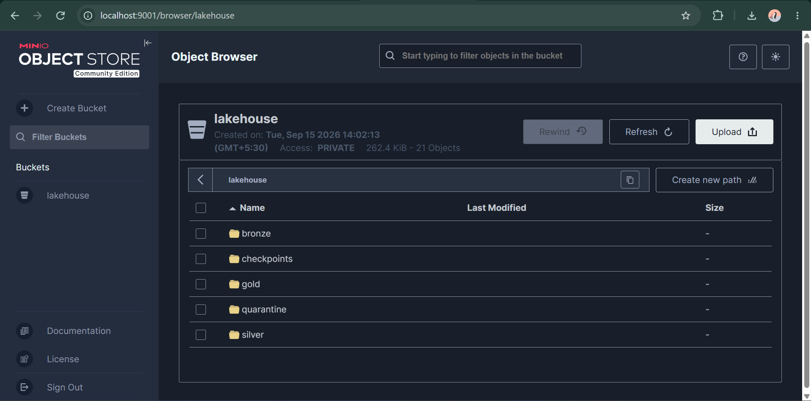
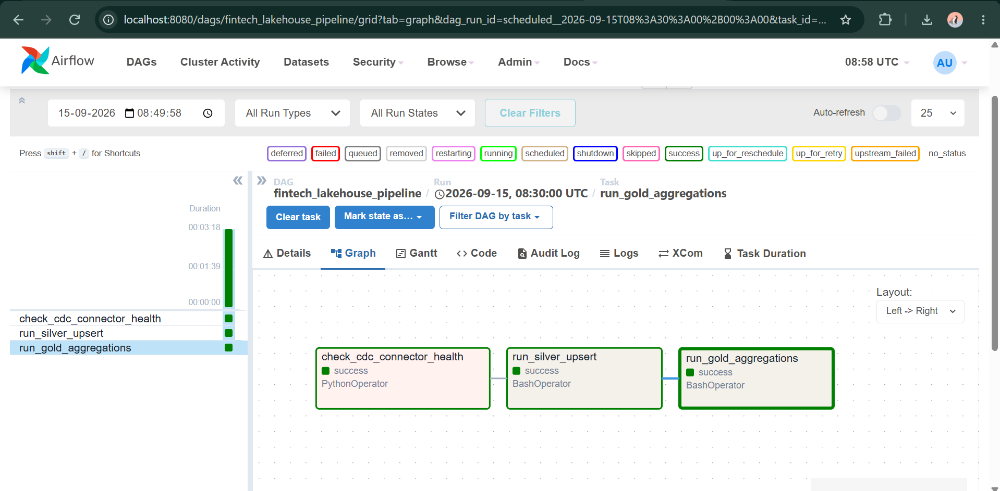
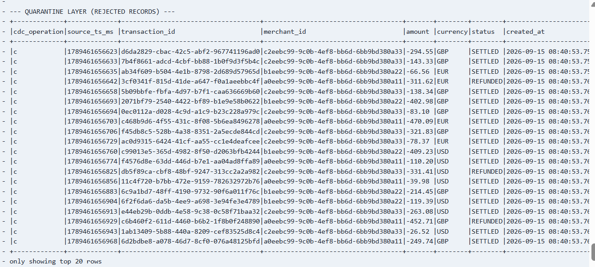
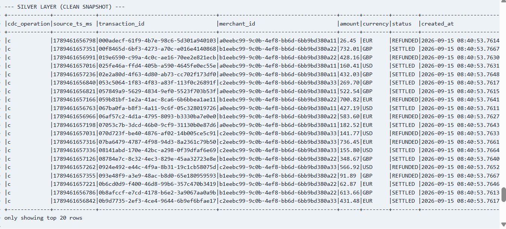
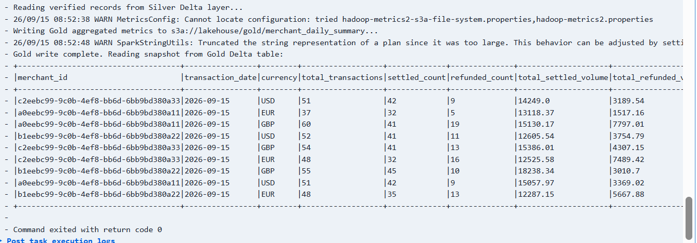
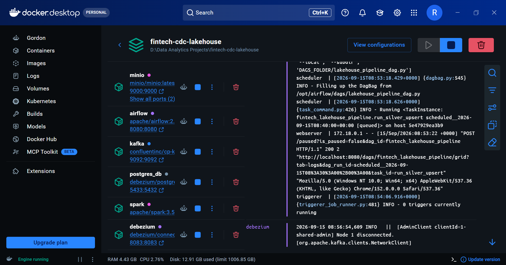

# FinTech CDC Medallion Lakehouse

An enterprise-grade, event-driven Data Lakehouse built with Apache Kafka, Debezium, Apache Spark, Delta Lake, MinIO, and DuckDB. The pipeline ingests financial transactions via log-based Change Data Capture (CDC), enforces transactional data quality checks via a Medallion architecture with a Quarantine layer, and serves analytical aggregates with zero-copy vectorized SQL.

---

## Architecture Overview

[ PostgreSQL (OLTP) ]
│ (Write-Ahead Log / WAL)
▼
[ Debezium Connector ] ──(Logical Decoding: pgoutput)──► [ Apache Kafka (KRaft) ]
│
│ (Spark Structured Streaming)
▼
[ MinIO Object Storage (S3) ]
├── Bronze: Raw CDC Stream (Parquet)
│
│ (Spark MERGE & Validation)
├── Silver: Conformed Ledger (Delta Lake)
│     ├── Valid Records (amount > 0)
│     └── Soft Deletes (is_deleted = true)
│
├── Quarantine: Dead-Letter Queue (Delta Lake)
│     └── Poison Pills (rejection_reason tagged)
│
│ (Spark Aggregation DAG)
└── Gold: Merchant Financial KPIs (Delta Lake)
│
▼
[ DuckDB (Zero-Copy OLAP) ]
---

## System Verification & Operational Observability

### 1. Storage Layout & Medallion Buckets (MinIO)
Partitioned object store hosting Bronze, Silver, Gold, and Quarantine layers:

### 2. Automated Pipeline Orchestration (Apache Airflow)
End-to-end DAG execution managing connector health checks, Delta upserts, and metric rollups:

### 3. Defensive Data Quality: Quarantine vs. Silver Conformance
Negative amount poison-pill records isolated with audit metadata, while valid transactions merge cleanly:

| Poison Pills Isolated in Quarantine | Clean Conformed Silver Ledger |
| :---: | :---: |
|  |  |

### 4. Curated Financial Aggregations (Gold Layer)
Daily merchant-level settlement volumes, refund metrics, and net revenue recalculation:

### 5. Distributed Infrastructure Runtime
Fully containerized microservices managed via Docker Compose:

---

## Key Architectural Decisions & Engineering Highlights

* **Log-Based CDC vs. Batch Polling:** Uses Debezium with PostgreSQL's `pgoutput` plugin to capture changes directly from the Write-Ahead Log (WAL), eliminating load on the operational database and capturing in-flight updates and deletes.
* **Metadata Quorum (Kafka KRaft):** Deploys Kafka without Apache ZooKeeper dependencies using the internal Raft metadata quorum for faster recovery and reduced infrastructure overhead.
* **Data Quality & Quarantine Routing:** Implements an automated dead-letter layer during Bronze-to-Silver transformations. Invalid transactions (negative amounts, null foreign keys) are isolated in `quarantine/` with audit tags without breaking the streaming pipeline.
* **ACID Guarantees & Lifecycle Mutations:** Uses Delta Lake `MERGE` statements on MinIO (S3 API) to handle the complete CDC lifecycle (inserts, updates, and regulatory soft deletes) with snapshot isolation.
* **Storage Governance:** Manages table health with automated `OPTIMIZE` (small-file compaction) and `VACUUM` (stale parquet tombstone purging) routines orchestrated via Apache Airflow.
* **Zero-Copy Serving Layer:** Employs DuckDB with `httpfs` and `delta` extensions to query remote Gold Delta tables directly using SIMD vectorized execution, bypassing dedicated data warehouse compute costs.

---

## Tech Stack

| Layer | Technology |
| :--- | :--- |
| **OLTP Database** | PostgreSQL 15 |
| **Change Data Capture** | Debezium 2.5 |
| **Event Streaming** | Apache Kafka 3.6 (KRaft Mode) |
| **Processing Engine** | Apache Spark 3.5 / PySpark |
| **Table Format** | Delta Lake 3.2 |
| **Object Storage** | MinIO (S3-compatible Object Storage) |
| **Serving & Analytics** | DuckDB (Embedded Vectorized Engine) |
| **Orchestration** | Apache Airflow 2.8 |
| **Infrastructure** | Docker Compose / Linux (WSL2) |

---

## Directory Structure

├── dags/                          # Apache Airflow orchestration DAGs
│   └── fintech_lakehouse_pipeline.py
├── scripts/                       # PySpark pipeline & load-testing scripts
│   ├── bronze_ingestion.py        # Streaming Kafka-to-Bronze consumer
│   ├── silver_upsert.py          # CDC merge, soft delete, & quarantine logic
│   ├── gold_aggregations.py       # Dimensional KPI aggregations
│   ├── delta_maintenance.py       # OPTIMIZE and VACUUM routines
│   └── simulate_traffic.py        # Multi-merchant transaction generator
├── streaming/
│   └── duckdbconnect.py          # Zero-copy DuckDB S3 query scripts
├── docker-compose.yml             # Full-stack container infrastructure
└── README.md

